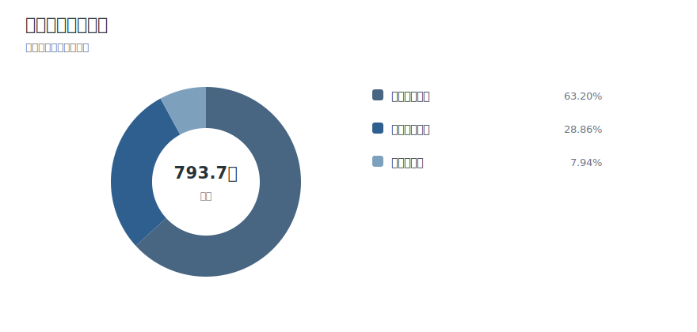
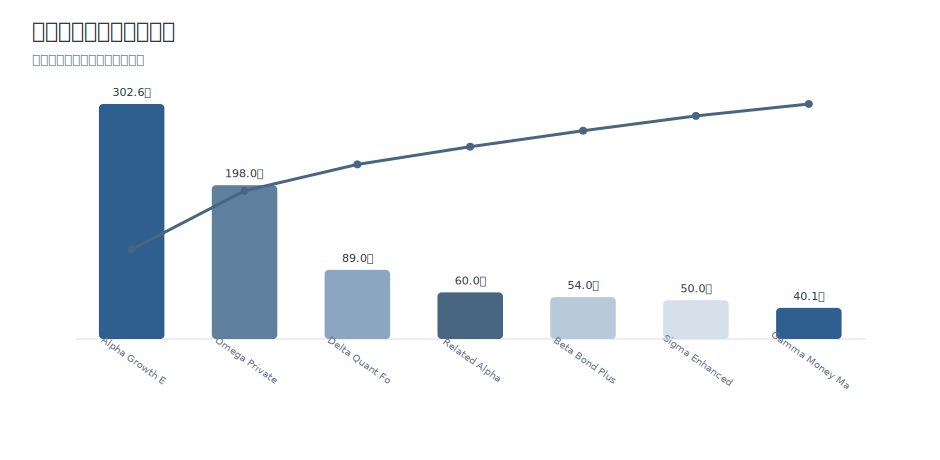
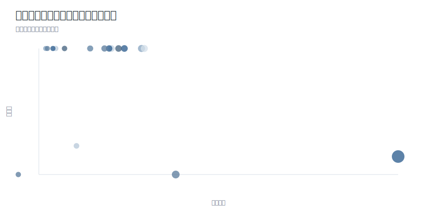
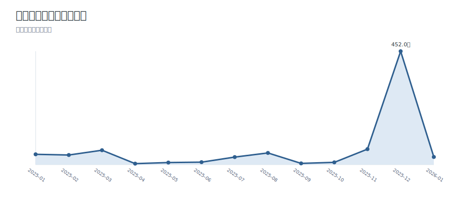
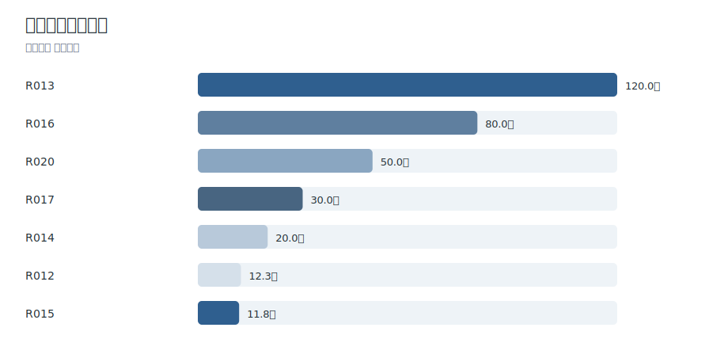

# 收入质量分析报告

## 1. 分析结论摘要

- 收入明细记录数：20 条。
- 账面确认收入合计：7,936,849.30。
- 按模型复算收入合计：4,696,849.32。
- 回款金额合计：5,166,849.30，整体回款覆盖率：65.10%。
- 触发至少一项风险信号的记录：9 条。
- 本次选入高风险样本池：8 条。

> 说明：本报告用于收入质量诊断、风险初筛和后续测试优先级排序，不直接等同于错报或舞弊结论。

## 3. 关键洞察与策略建议

### 洞察 1：收入质量明显偏弱，超六成收入被标记为可疑增长，需重点验证其真实性与可持续性。
- 证据：可疑增长收入占总收入63.75%（5,136,438.36元），远超稳定基础收入（28.43%）和交易型收入（7.82%）。整体现金回款率仅65.1%，且12月收入同比暴增390万元，主要来自高波动产品。
- 判断：收入质量较差，严重依赖期末集中确认且偏离预期的项目，可持续性偏弱。
- 建议：全面核查可疑增长收入段的所有交易，尤其是12月份大额收入，获取合同、AUM数据和回款证明。

### 洞察 2：收入来源高度集中于少数高波动产品，抵抗市场下行能力弱，持续贡献存疑。
- 证据：前三大产品（Alpha Growth Equity、Omega Private Fund、Delta Quant FoF）合计占比74.67%，其中Alpha和Omega均属高波动，高波动类别整体占比82.12%。
- 判断：客户集中度和资产类别风险过高，任何单一产品表现逆转将严重影响总收入。
- 建议：评估前三大产品的客户留存率和历史收入波动，分散产品依赖，并监控其AUM变化。

### 洞察 3：现金回款比率仅65.1%，与确认收入严重脱节，部分大额收入回款极低或为零，存在坏账或虚增风险。
- 证据：整体现金收款5,166,849.30元，回款比率0.651。可疑记录：Omega Private Fund回款比14.29%（R013），Delta Quant FoF回款比0%（R016），Gamma Money Market回款比22.73%（R015）。
- 判断：收入确认与现金流入显著不匹配，尤其高波动私募产品几乎无回款，需怀疑收入确认条件是否满足。
- 建议：逐笔对比合同付款条款，检查应收账款账龄，对零回款或低回款项目发函确认并评估减值。

### 洞察 4：12月收入暴增至452万元，同比飙升390万元，期末集中确认特征明显，存在明显的收入粉饰迹象。
- 证据：峰值期间2025-12收入4,520,000元，上一期仅约61.6万元（R012），增长390万元。Top峰值贡献者均存在“期末集中确认”风险标记，且后一期已出现Omega冲回-12万元（R019）。
- 判断：可能存在提前确认或虚构收入以粉饰报表，尤其是期末突击。
- 建议：针对12月大额收入，逐一核对合同生效日、服务提供期和收款权，检查是否有跨期调节，核实后续冲回情况。

### 洞察 5：关联方收入与合同费率偏差叠加，收入数字可操纵空间大，需独立验证交易实质。
- 证据：Related Alpha Fund（R017）为关联方，确认收入60万元，预期仅30万元，偏差30万元，且存在“收入复算偏差”和“合同费率偏差”。另Omega（R013）等也存在费率偏差。
- 判断：关联交易加上费率异常，可能未按公允价格执行，收入可靠性存疑。
- 建议：获取关联方交易合同，比对市场费率，审查交易条款是否合理，必要时聘请第三方估值。

## 4. 收入质量分层

| 收入分层 | 收入金额 | 占正向收入比例 | 业务含义 |
| --- | ---: | ---: | --- |
| 可疑增长收入 | 5,136,438.36 | 63.75% | 同时触发计价、回款、期后或关联方等质量信号，需要优先验证。 |
| 稳定基础收入 | 2,290,410.94 | 28.43% | 主要由 AUM 和计费天数驱动，通常更可持续。 |
| 交易型收入 | 630,000.00 | 7.82% | 由申购/赎回交易驱动，受客户行为和市场活跃度影响。 |

## 5. 增长质量归因

- 收入最高期间：2025-12，收入金额 4,520,000.00。
- 相比 2025-11 变化：3,903,561.64。
- 主要贡献样本：

| 记录 | 产品 | 产品类型 | 风险暴露 | 收入分层 | 收入金额 | 质量判断 |
| --- | --- | --- | --- | --- | ---: | --- |
| R013 | Omega Private Fund | 私募/专户产品 | 高波动 | 可疑增长收入 | 2,100,000.00 | 需单独验证 |
| R016 | Delta Quant FoF | FOF基金 | 高波动 | 可疑增长收入 | 800,000.00 | 需单独验证 |
| R017 | Related Alpha Fund | 偏股型基金 | 高波动 | 可疑增长收入 | 600,000.00 | 需单独验证 |
| R020 | Sigma Enhanced Bond | 债券型基金 | 低波动 | 可疑增长收入 | 500,000.00 | 需单独验证 |
| R014 | Beta Bond Plus | 债券型基金 | 低波动 | 可疑增长收入 | 300,000.00 | 需单独验证 |

## 6. 数据口径与勾稽检查

- 发现 1 个期间收入明细与总账存在差异，请优先核对口径。

| 期间 | 明细收入 | 总账收入 | 差异 |
| --- | ---: | ---: | ---: |
| 2025-01 | 410,958.90 | 410,958.90 | 0.00 |
| 2025-02 | 383,561.64 | 383,561.64 | 0.00 |
| 2025-03 | 574,657.53 | 574,657.53 | 0.00 |
| 2025-04 | 40,000.00 | 40,000.00 | 0.00 |
| 2025-05 | 82,191.78 | 82,191.78 | 0.00 |
| 2025-06 | 98,630.14 | 98,630.14 | 0.00 |
| 2025-07 | 300,000.00 | 300,000.00 | 0.00 |
| 2025-08 | 465,753.42 | 465,753.42 | 0.00 |
| 2025-09 | 50,000.00 | 50,000.00 | 0.00 |
| 2025-10 | 90,000.00 | 90,000.00 | 0.00 |
| 2025-11 | 616,438.36 | 616,438.36 | 0.00 |
| 2025-12 | 4,520,000.00 | 4,526,438.36 | -6,438.36 |
| 2026-01 | 304,657.53 | 304,657.53 | 0.00 |

## 7. 收入模型识别

- fund_fee：20 条记录。
- 本 MVP 使用基金/资管手续费收入路径：按申购费、赎回费、管理费、销售服务费、业绩报酬分别选择复算公式和风险信号。

## 8. 收入结构与产品画像

### 费用类型

| 维度 | 收入金额 | 占比 |
| --- | ---: | ---: |
| management_fee | 3,226,027.38 | 40.65% |
| subscription_fee | 3,120,000.00 | 39.31% |
| performance_fee | 800,000.00 | 10.08% |
| sales_service_fee | 400,821.92 | 5.05% |
| redemption_fee | 390,000.00 | 4.91% |

### 基金产品

| 维度 | 收入金额 | 占比 |
| --- | ---: | ---: |
| Alpha Growth Equity | 3,026,027.38 | 38.13% |
| Omega Private Fund | 1,980,000.00 | 24.95% |
| Delta Quant FoF | 890,000.00 | 11.21% |
| Related Alpha Fund | 600,000.00 | 7.56% |
| Beta Bond Plus | 540,000.00 | 6.80% |
| Sigma Enhanced Bond | 500,000.00 | 6.30% |
| Gamma Money Market | 400,821.92 | 5.05% |

### 产品类型

| 维度 | 收入金额 | 占比 |
| --- | ---: | ---: |
| 偏股型基金 | 3,626,027.38 | 45.69% |
| 私募/专户产品 | 1,980,000.00 | 24.95% |
| 债券型基金 | 1,040,000.00 | 13.10% |
| FOF基金 | 890,000.00 | 11.21% |
| 货币型基金 | 400,821.92 | 5.05% |

### 规模分层

| 维度 | 收入金额 | 占比 |
| --- | ---: | ---: |
| 大规模 | 3,426,849.30 | 43.18% |
| 小规模 | 3,370,000.00 | 42.46% |
| 中规模 | 1,140,000.00 | 14.36% |

### 风险暴露

| 维度 | 收入金额 | 占比 |
| --- | ---: | ---: |
| 高波动 | 6,496,027.38 | 81.85% |
| 低波动 | 1,440,821.92 | 18.15% |

### 渠道

| 维度 | 收入金额 | 占比 |
| --- | ---: | ---: |
| direct | 6,406,027.38 | 80.71% |
| bank | 1,040,000.00 | 13.10% |
| online | 490,821.92 | 6.18% |

### 客户类型

| 维度 | 收入金额 | 占比 |
| --- | ---: | ---: |
| institutional | 6,306,027.38 | 79.45% |
| retail | 1,030,821.92 | 12.99% |
| related_party | 600,000.00 | 7.56% |

## 9. 费率与计费复算

| 记录 | 费用类型 | 账面收入 | 复算收入 | 差异 | 合同费率 | 实际费率 |
| --- | --- | ---: | ---: | ---: | ---: | ---: |
| R013 | subscription_fee | 2,100,000.00 | 900,000.00 | 1,200,000.00 | 0.30% | 0.70% |
| R017 | subscription_fee | 600,000.00 | 300,000.00 | 300,000.00 | 0.30% | 0.60% |
| R014 | redemption_fee | 300,000.00 | 100,000.00 | 200,000.00 | 0.20% | 0.60% |
| R015 | sales_service_fee | 220,000.00 | 101,917.81 | 118,082.19 | 0.20% | 0.43% |
| R012 | management_fee | 616,438.36 | 493,150.68 | 123,287.68 | 0.50% | 0.63% |

## 10. 收入质量信号分布

| 风险信号 | 记录数 |
| --- | ---: |
| 期末集中确认 | 8 |
| 收入复算偏差 | 5 |
| 合同费率偏差 | 5 |
| 低回款覆盖 | 3 |
| 大额收入 | 2 |
| 期后退款或冲回 | 2 |
| 新客户大额收入 | 1 |
| 业绩报酬门槛未满足 | 1 |
| 关联方收入 | 1 |
| 缺少业务量/AUM支撑 | 1 |

## 11. 高风险样本池

| 记录 | 期间 | 产品 | 收入分层 | 收入金额 | 风险分 | 主要原因 |
| --- | --- | --- | --- | ---: | ---: | --- |
| R013 | 2025-12 | Omega Private Fund | 可疑增长收入 | 2,100,000.00 | 110 | 大额收入、期末集中确认、收入复算偏差、合同费率偏差、低回款覆盖、新客户大额收入 |
| R016 | 2025-12 | Delta Quant FoF | 可疑增长收入 | 800,000.00 | 80 | 大额收入、期末集中确认、业绩报酬门槛未满足、低回款覆盖 |
| R017 | 2025-12 | Related Alpha Fund | 可疑增长收入 | 600,000.00 | 80 | 期末集中确认、收入复算偏差、合同费率偏差、关联方收入 |
| R014 | 2025-12 | Beta Bond Plus | 可疑增长收入 | 300,000.00 | 80 | 期末集中确认、收入复算偏差、合同费率偏差、期后退款或冲回 |
| R015 | 2025-12 | Gamma Money Market | 可疑增长收入 | 220,000.00 | 75 | 期末集中确认、收入复算偏差、合同费率偏差、低回款覆盖 |
| R012 | 2025-11 | Alpha Growth Equity | 可疑增长收入 | 616,438.36 | 60 | 期末集中确认、收入复算偏差、合同费率偏差 |
| R020 | 2025-12 | Sigma Enhanced Bond | 可疑增长收入 | 500,000.00 | 40 | 期末集中确认、缺少业务量/AUM支撑 |
| R019 | 2026-01 | Omega Private Fund | 可疑增长收入 | -120,000.00 | 20 | 期后退款或冲回 |

## 12. 后续处理建议

### R013 - Omega Private Fund / subscription_fee
- 收入质量判断：可疑增长收入。
- 建议获取资料：基金合同/费率表、TA申购确认、销售渠道结算单、发票、银行回单。
- 建议追问：该笔收入在期末确认，请说明对应交易确认日/服务期间/结算日，是否存在跨期确认风险？；该笔收入复算金额与账面确认金额不一致，请说明差异来源，是费率优惠、渠道分成、补提还是计算口径差异？；实际费率与合同费率存在偏差，请提供费率表、补充协议或审批记录。；该笔收入回款覆盖较低，请说明截至报告日的回款状态、未回款原因和后续收款安排。；新客户首笔收入金额较大，请提供客户背景、合同、交易确认和回款证据。

### R016 - Delta Quant FoF / performance_fee
- 收入质量判断：可疑增长收入。
- 建议获取资料：业绩报酬条款、业绩基准/门槛证明、超额收益计算表、复核记录、结算单。
- 建议追问：该笔收入在期末确认，请说明对应交易确认日/服务期间/结算日，是否存在跨期确认风险？；业绩报酬确认前是否已经满足计提门槛？请提供业绩基准、超额收益计算表和复核记录。；该笔收入回款覆盖较低，请说明截至报告日的回款状态、未回款原因和后续收款安排。

### R017 - Related Alpha Fund / subscription_fee
- 收入质量判断：可疑增长收入。
- 建议获取资料：基金合同/费率表、TA申购确认、销售渠道结算单、发票、银行回单。
- 建议追问：该笔收入在期末确认，请说明对应交易确认日/服务期间/结算日，是否存在跨期确认风险？；该笔收入复算金额与账面确认金额不一致，请说明差异来源，是费率优惠、渠道分成、补提还是计算口径差异？；实际费率与合同费率存在偏差，请提供费率表、补充协议或审批记录。；该笔收入涉及关联方，请说明定价是否公允、交易是否具有商业实质以及是否需要抵销或披露。

### R014 - Beta Bond Plus / redemption_fee
- 收入质量判断：可疑增长收入。
- 建议获取资料：基金合同/费率表、TA赎回确认、赎回费计算表、发票、银行回单、期后退款明细。
- 建议追问：该笔收入在期末确认，请说明对应交易确认日/服务期间/结算日，是否存在跨期确认风险？；该笔收入复算金额与账面确认金额不一致，请说明差异来源，是费率优惠、渠道分成、补提还是计算口径差异？；实际费率与合同费率存在偏差，请提供费率表、补充协议或审批记录。；该笔收入期后发生退款或冲回，请说明原始交易、退款原因以及是否影响本期收入确认。

### R015 - Gamma Money Market / sales_service_fee
- 收入质量判断：可疑增长收入。
- 建议获取资料：销售服务协议、C类份额AUM明细、服务费率表、渠道结算单、发票、银行回单。
- 建议追问：该笔收入在期末确认，请说明对应交易确认日/服务期间/结算日，是否存在跨期确认风险？；该笔收入复算金额与账面确认金额不一致，请说明差异来源，是费率优惠、渠道分成、补提还是计算口径差异？；实际费率与合同费率存在偏差，请提供费率表、补充协议或审批记录。；该笔收入回款覆盖较低，请说明截至报告日的回款状态、未回款原因和后续收款安排。

### R012 - Alpha Growth Equity / management_fee
- 收入质量判断：可疑增长收入。
- 建议获取资料：基金合同/管理费条款、按产品/份额类别AUM明细、计费天数、基金会计结算单、银行回单。
- 建议追问：该笔收入在期末确认，请说明对应交易确认日/服务期间/结算日，是否存在跨期确认风险？；该笔收入复算金额与账面确认金额不一致，请说明差异来源，是费率优惠、渠道分成、补提还是计算口径差异？；实际费率与合同费率存在偏差，请提供费率表、补充协议或审批记录。

### R020 - Sigma Enhanced Bond / management_fee
- 收入质量判断：可疑增长收入。
- 建议获取资料：基金合同/管理费条款、按产品/份额类别AUM明细、计费天数、基金会计结算单、银行回单。
- 建议追问：该笔收入在期末确认，请说明对应交易确认日/服务期间/结算日，是否存在跨期确认风险？；这笔收入缺少对应交易金额、平均AUM或计费天数支撑，请补充业务量明细和计算过程。

### R019 - Omega Private Fund / subscription_fee
- 收入质量判断：可疑增长收入。
- 建议获取资料：基金合同/费率表、TA申购确认、销售渠道结算单、发票、银行回单。
- 建议追问：该笔收入期后发生退款或冲回，请说明原始交易、退款原因以及是否影响本期收入确认。

## 13. 可用于面试的讲法

我把收入分析从简单抽样升级成收入质量诊断：先识别收入模型，再加入产品类型、规模分层、风险暴露和收入稳定性分类，判断收入增长到底来自稳定基础收入，还是来自一次性交易、期末大额或待验证收入。然后我用复算差异、费率偏差、回款、期后退款、关联方和新客户等信号生成风险评分，并进一步输出洞察和行动建议。这样项目不只是筛高风险样本，而是能解释收入增长的质量、可持续性和下一步验证重点。
